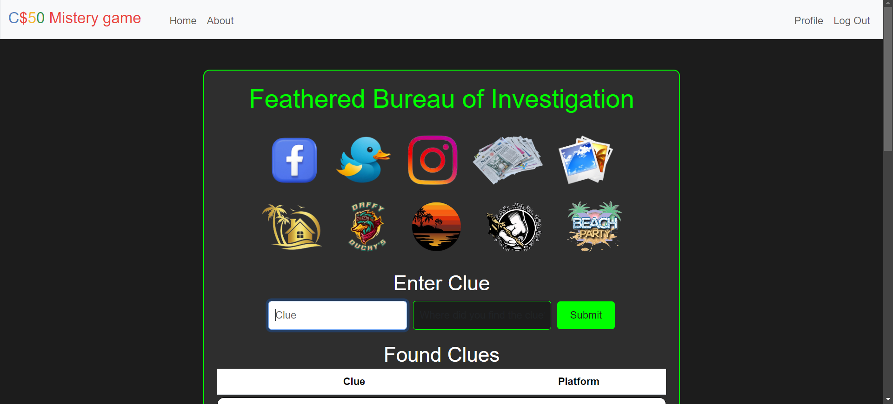
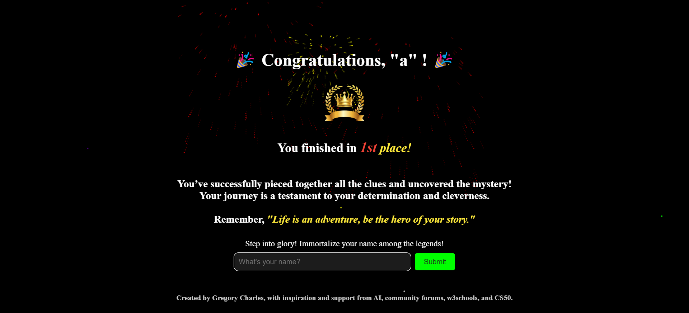

# 🦆 Quacktastic Conundrum


**Quacktastic Conundrum** is a hilarious and thrilling mystery game inspired by a combination of **CS50’s Fiftyville** and the classic movie **The Hangover**. After a wild night out, you and your college friends wake up with fragmented memories—and one very important item missing: Harvard’s precious rubber duck mascot. Your task is to piece together clues and retrace your steps through social media platforms, bars, and various locations to recover the missing duck.
#### Video Demo:  <[URL HERE](https://www.youtube.com/watch?v=M8YOX5bFVbg)>

🌟 **Quacktastic Conundrum** was designed for puzzle lovers who enjoy cracking mysteries with a mix of logic, creativity, and humor. Good luck finding that duck! 🦆

## 📚 Table of Contents

- [Game Overview](#-game-overview)
- [Screenshots](#-screenshots)
- [Key Features](#-key-features)
- [Tech Stack](#-tech-stack)
- [Installation and Setup](#-installation-and-setup)
- [Usage Instructions](#-usage-instructions)
- [Game Flow Example](#-game-flow-example)
- [API and Routes](#-api-and-routes)
- [Contributing](#-contributing)
- [License](#-license)
- [Acknowledgments](#-acknowledgments)
- [Improvements for Quacktastic Conundrum Project](#-improvements-for-quacktastic-conundrum-project)
- [File Arrangement](#-file-arrangement)


## 🦸‍♂️ Game Overview

Quacktastic Conundrum challenges players to use their investigative skills by uncovering clues hidden in a variety of digital environments. Players must navigate fictional social media platforms, solve puzzles, and connect the dots to figure out what happened to the missing mascot.

This game is a blend of adventure, mystery, and digital sleuthing, perfect for anyone who enjoys a challenge.

---

## 📸 Screenshots

<!-- Add your screenshot links here -->

| Dashboard Interface    | Fakebook Platform |
|-------------------|-------------------|
|  |  |
| Hint code with added time    | Endgame |
|-------------------|-------------------|
|  |  |

---

## 🚀 Key Features
🔑**User Registration & Authentication**:
  - Users can register with a unique username, password, and an optional fingerprint for enhanced security.
  - Login attempts are monitored with a failed attempts counter to prevent brute-force attacks.

🔒**Secure Sessions**:
  - Utilizes secure session cookies with various settings to mitigate security risks, including HTTPS enforcement and HTTP-only cookies.

🗄️**Database Integration**:
  - The application is powered by a SQLite database, utilizing the CS50 Library for streamlined database interactions.
  - User data, including username, hashed password, fingerprint, and registration details, are securely stored.

🛡️**Input Sanitization**:
  - All user inputs are sanitized to prevent XSS attacks using the `bleach` library, allowing only specified tags and attributes.

🕒**Time Tracking**:
  - The game tracks total time spent by players, allowing users to accumulate and save their gameplay duration.
  - Displays time in a user-friendly format (DD:HH:MM:SS or HH:MM:SS) on the main page.

🗝️ **Clue Management**:
  - Players can access a series of clues through various platforms, with mechanisms to retrieve hints based on their progress.
  - Clue tracking allows users to see which clues have been found and how many remain.

**Responsive User Interface**:
  - The application provides a clean and interactive front-end experience using Flask's templating engine.
  - User profiles allow for the updating of usernames and passwords.

**Hint System**:
  - Players can request hints for their next clue, enhancing engagement and reducing frustration.
  - Hints are context-sensitive, based on the player's current progress.


---

## 💻 Tech Stack

| Technology              | Purpose                                      |
|-------------------------|----------------------------------------------|
| **Flask**                | For web framework and routing.                                |
| **SQLite**               | For database management.                    |
| **CS50 Library**     | For simplified database operations.                 |
| **dotenv**               | For managing environment variables (API keys, secret keys).               |
| **Bleach**               | Input sanitization to prevent XSS            |
| **Werkzeug**             | For password hashing and security features.                        |
| **Flask-Session**  | For managing user sessions securely.                        |

---

## 🛠️ Installation and Setup

### Prerequisites

- **Python 3.x**
- **SQLite3**
- **Flask**

### Installation Instructions

1. **Clone the repository**:
   ```bash
   git clone <repository-url>
   cd project
   ```

2. **Set up a virtual environment** (optional but recommended):
   ```bash
   python3 -m venv venv
   source venv/bin/activate  # On Windows: venv\Scripts\activate
   ```

3. **Install dependencies**:
   ```bash
   pip install python-dotenv
   pip install bleach
   pip install -r requirements.txt
   ```

4. **Create `.env` file** and add your environment variables:
   ```bash
   API_KEY=<your_api_key>
   SECRET_KEY=<your_secret_key>
   ```

5. **Initialize the SQLite Database**:
   Ensure `game.db` is properly set up and populated. If needed, run the setup script included in the repository.

6. **Run the application**:
   ```bash
   flask run
   ```

7. **Access the game**:
   Open a browser and navigate to `http://127.0.0.1:5000/`.

---

## 🎮 Usage Instructions

1. **Register/Login**: Create a new account or log in with your credentials.
2. **Start the game**: Begin exploring the fictional world and receive your first clue.
3. **Solve Clues**: Use the available platforms (Fakebook, Quacker, etc.) to track down the missing mascot.
4. **Progress**: Uncover more clues as you solve puzzles, ultimately leading to the rubber duck’s location.

---

## 🧭 Game Flow Example

- **Home**: Players start on the homepage after logging in.

- **Initial Clue Gathering**: Players must discover 3 to 4 initial clues in other locations or platforms to unlock access to Fakebook. This adds an exciting challenge as they piece together the beginnings of their investigation.

- **Fakebook**: Once the required initial clues are collected, players can proceed to the Fakebook platform, where the first significant clue related to the missing mascot awaits.

- **Multiple Platforms**: Players interact with clues scattered across Fakebook, Quacker, Instaquam, and more, building a web of information to track down the missing mascot.

- **Clue Validation**: Once a clue is entered correctly, the next clue is unlocked, guiding players deeper into the mystery.

---

## 🌐 API and Routes

| Route           | Description                                    |
|-----------------|------------------------------------------------|
| `/`             | Homepage (requires login)                      |
| `/register`     | Register a new user                            |
| `/login`        | User login                                     |
| `/logout`       | Log out of the game                            |
| `/profile`      | View and manage your profile                   |
| `/about`        | Learn more about the game                      |
| `/clue_input`   | Submit a clue for validation                   |
| `/fakebook`     | Explore clues from Fakebook platform           |
| `/quacker`      | Explore clues from Quacker platform            |
| `/instaquam`    | Explore clues from Instaquam platform
| `/endgame`      | Display final results once the mystery is solved|

---

## 🤝 Contributing

Contributions are welcome! Whether it's reporting a bug, suggesting a feature, or creating a pull request, I value all kinds of contributions.

---

## 📄 License

This project is licensed under the MIT License. See the [LICENSE](LICENSE) file for more details.

---

## 🏆 Acknowledgments

- **CS50 Library**: For simplifying database interactions.
- **Flask Team**: For creating a powerful yet simple web framework.
- **Open Source**: Shoutout to the open-source libraries that made this project possible.
- **AI Assistance**: Special thanks to AI-driven tools that enhanced the development process by aiding with code generation, documentation, and brainstorming. AI helped streamline workflows, improve efficiency, and ensure the best possible version of this project came to life.


---


## 🛠️Improvements for Quacktastic Conundrum Project💡

This document outlines potential improvements for the **Quacktastic Conundrum** game to enhance security and streamline code efficiency. These suggestions address current limitations and possible solutions for future development.

## Suggested Improvements

### 1) 🔒Database Encryption

To increase the security of sensitive game data, encrypting the SQLite database would be beneficial. Currently, encryption is not implemented due to the following challenges:

- **Lack of Expertise**: Implementing encryption requires knowledge of encryption libraries and techniques.
- **CS50 Platform Restrictions**: SQLCipher, a popular choice for encrypting SQLite databases, cannot be installed or used on the CS50 platform, limiting available encryption options.

💡**Potential Solutions**💡:
- Explore lightweight encryption methods compatible with SQLite, if CS50 platform support is extended.
- Consider transitioning to a more secure environment post-CS50, where SQLCipher or similar tools can be implemented.

### 2) ⚙️Streamlining Templates for Social Media Platforms

In the current game structure, **Fakebook**, **Quacker**, and **Instaquam** use individual templates for their login pages. This approach, while functional, increases the amount of repetitive code and can be optimized for maintainability.

💡**Improvement Idea**💡:
- Implement a single, reusable login template for all three social media platforms. Using a shared template would reduce code duplication and make future updates easier.
- Utilize parameters to customize the template for each platform, allowing for distinctive styling or branding while keeping the codebase more concise.

**Example Implementation**:
A single HTML template could be designed with placeholders for platform-specific details. This template could then be rendered dynamically based on the platform being accessed, minimizing redundancy and simplifying the codebase.

---

By addressing these improvements, the **Quacktastic Conundrum** project can advance in both security and code efficiency, providing a more robust and maintainable user experience.


## 📁 File Arrangement

The **Quacktastic Conundrum** project features a well-structured file arrangement designed for easy navigation and efficient management. Click below to expand and view the project structure:

<details>
<summary>📂 Click to Expand File Structure</summary>

```plaintext
project/
├── static/                  # Contains static files such as CSS, JavaScript, and images
│   ├── css/                     # Stylesheets
│   │   ├── bar.css                 # Stylesheet for the bar platform
│   │   ├── fakebook.css            # Stylesheet for the fakebook platform
│   │   ├── dashboard.css           # Main stylesheet for the application
│   │   └── ...
│   │
│   ├── images/                  # Image assets used in the game# JavaScript files
│   │   ├── bar/                    # Folder with pictures for the bar platform
│   │   ├── beach/                  # Folder with pictures for the beach platform
│   │   ├── .../                    # Other folders for different platforms
│   │   ├── final1.png                 # Endgame's final picture
│   │   ├── screenshot1.png            # Example README.md screenshot 1
│   │   ├── screenshot2.png            # Example README.md screenshot 2
│   │   ├── screenshot3.png            # Example README.md screenshot 3
│   │   └── screenshot4.png            # Example README.md screenshot 4
│   │
│   └── script.js                # Main JavaScript file for interactive
│
├── templates/               # Jinja2 templates for rendering HTML
│   ├── about.html               # Game story
│   ├── apology.html             # Apology template
│   ├── bar.html                 # Bar platform template
│   ├── beach.html               # Beach platform template
│   ├── endgame.html             # Endgame platform template
│   ├── fakebook_login.html      # Fakebook login platform template
│   ├── fakebook.html            # Fakebook platform template
│   ├── gallery.html             # Smartphone gallery platform template
│   ├── hotel.html               # Hotel platform template
│   ├── index.html               # Dashboard platform template
│   ├── instaquam_login.html     # Instaquam login platform template
│   ├── layout.html              # Base layout template
│   ├── login.html               # Login page template
│   ├── newspaper.html           # Newspaper page template
│   ├── party.html               # Party page template
│   ├── profile.html             # User profile page template
│   ├── quacker_login.html       # Quacker platform template
│   ├── quacker.html             # Quacker platform template
│   ├── register.html            # Registration page template
│   └── tattoo.html              # Tattoo parlor page template
│
├── app.py                   # Main application file
├── helpers.py               # Apology function/ Bleach
├── requirements.txt         # List of Python dependencies
├── .env                     # Environment variables file
├── game.db                  # Game database
└── README.md                # Project documentation

```
</details>

## 📅 Future Enhancements

- 🚀 **AI Integration**: Explore AI-driven features that could enhance gameplay by personalizing clues based on user behavior.
- 🌍 **Mobile Compatibility**: Develop a mobile-friendly version of the game to broaden accessibility.
- 🎨 **Graphics and UI**: Invest in improving the user interface and graphics to make the game more visually appealing and engaging.
- 🌐 **Multiplayer Mode**: Consider adding a multiplayer option to enhance the social aspect of the game.

---

## 🙏 Feedback and Support

I welcome your feedback on this project! If you encounter any issues or have suggestions for improvements, please reach out via the project's GitHub issues page.
