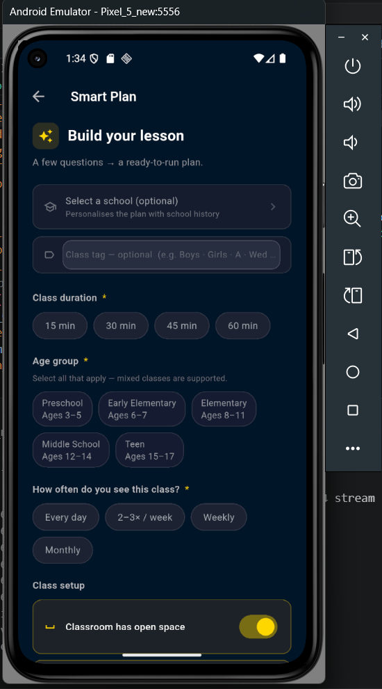

# Lumina — Educational Decision Support System (EDSS)

**Independent EdTech Product · Active Development**  
**Flutter · Dart · Riverpod · Drift/SQLite · Adaptive Recommendations · Educational Data Engineering**

> **Public Portfolio / Product Showcase**
>
> Lumina is an independently developed **AI-enabled Educational Decision Support System (EDSS)** for teachers. It supports lesson planning, classroom delivery, teaching-resource selection, lesson history, and evidence-informed recommendations.
>
> This public repository intentionally contains **documentation and selected product visuals only**. The full source code, proprietary educational datasets, recommendation implementation, internal planning logic, and original asset library are not publicly distributed.

---

## Overview

**Lumina** is a teacher decision-support application designed around a simple idea:

> **Plan → Teach → Observe → Learn → Recommend**

Teachers working across different classes and schools repeatedly make decisions about:

- what to teach;
- which activities fit a particular class;
- which resources are appropriate;
- how to structure a lesson within limited time;
- what worked previously;
- what should be repeated, changed, or avoided;
- which vocabulary or grammar should be introduced or reviewed.

Much of that information is normally fragmented across memory, notes, folders, media applications, and previous lesson plans.

Lumina brings those signals into one structured workflow.

---

## Why an Educational Decision Support System?

Lumina is broader than a lesson-plan generator.

It supports multiple instructional decisions:

```text
Teaching Context
      ↓
Lesson Planning
      ↓
Resource Selection
      ↓
Classroom Delivery
      ↓
Engagement Feedback
      ↓
Teaching History
      ↓
Adaptive Recommendations
      ↓
Future Planning
```

The system is designed to **assist teacher judgment rather than replace it**.

Teachers remain in control of:

- lesson goals;
- requested content;
- activity choices;
- sequencing;
- media;
- classroom adjustments;
- final instructional decisions.

---

## AI-Enabled — Without Pretending Everything Is Generative AI

Lumina currently combines several forms of computational intelligence.

### Constraint-Based Decision Logic

Smart Plan considers structured instructional constraints such as:

- learner age;
- topic;
- lesson duration;
- classroom context;
- available resources;
- physical-space requirements;
- teacher requests;
- previous lesson information.

### Adaptive Recommendation

Classroom engagement history can influence future activity recommendations.

The system uses a **Bayesian recommendation approach** that balances contextual/pedagogical suitability with observed classroom outcomes.

The implementation details and scoring logic are intentionally not published in this showcase.

### Generative AI

Generative-AI functionality is a **future/selected extension**, not the mechanism currently responsible for the core Smart Plan system.

This distinction is intentional: not every educational decision benefits from an LLM.

---

## Core Capabilities

### Smart Plan

Builds structured lesson plans from teaching context and available resources.

Inputs can include:

- school/class context;
- age group;
- topic;
- duration;
- teacher-requested content;
- available activities;
- available music/video;
- previous lesson information.

The teacher can inspect and modify the result rather than being locked into an automatically generated plan.

---

### Multi-Lesson Planning

Lumina can coordinate content across several lessons instead of generating each lesson independently.

This supports:

- better content rotation;
- reduced unnecessary repetition;
- review;
- progression;
- assessment-oriented lesson sequences.

---

### Adaptive Activity Recommendations

Activities can be recommended using a combination of:

- pedagogical suitability;
- lesson context;
- school/class history;
- previous engagement.

This helps the system become more useful as classroom evidence accumulates.

---

### Quick Start Classroom Runner

Generated or saved plans can be executed directly in class.

The classroom workflow includes:

- lesson queues;
- ordered lesson slots;
- timers;
- activity progression;
- media access;
- skipping/reordering;
- post-activity engagement feedback.

Quick Start connects planning to actual classroom execution.

---

### Lesson History & Feedback

Completed lessons can retain structured information such as:

- teaching context;
- lesson structure;
- date;
- engagement ratings;
- notes.

The important design goal is not merely to store history, but to use that history to support future decisions.

---

### School-Aware Teaching Context

Lumina can maintain school-specific teaching information and session history.

This reflects a practical reality:

> the same activity can perform very differently with different groups and teaching environments.

School context therefore contributes to the application's institutional-memory layer.

---

### Activities Library

Teaching activities can be organized using structured educational metadata.

Examples of supported metadata include:

- topic;
- age suitability;
- skills;
- difficulty;
- movement;
- materials;
- variants;
- teacher guidance.

The same structured activity data can support browsing, planning, classroom execution, and later recommendation.

---

### Music & Video

Lumina integrates classroom media into the same teaching workflow.

Media can be organized with pedagogical metadata and used directly within lesson plans rather than being stored as an unrelated media collection.

---

### Grammar Tools

The grammar subsystem supports more than static reference material.

Current concepts include:

- teaching/practice modes;
- level-aware examples;
- grammar comparison;
- common mistakes;
- tense-selection guidance;
- context-sensitive example selection.

---

### Vocabulary & Flashcards

A large structured vocabulary system is currently being expanded.

The architecture supports:

- **CEFR**
- **Eiken**
- **TOEIC**
- lexical categories;
- definitions;
- examples;
- Japanese support;
- semantic relationships such as synonyms and antonyms.

Interactive vocabulary browsing and flashcard study are also under development.

---

### Original Educational Image Corpus

An original visual corpus is being created for educational flashcards.

The goal is to connect structured vocabulary data with consistent, recognizable classroom imagery.

**Status:** actively being produced and expanded.

---

## Development Status

### ✅ Implemented / Functional

| Area | Capability |
| --- | --- |
| **Smart Plan** | Constraint-aware lesson planning |
| **Multi-Lesson Planning** | Coordinated lesson-bundle scheduling |
| **Quick Start** | Classroom lesson execution |
| **Adaptive Recommendations** | Context/history-informed activity ranking |
| **Lesson History** | Completed lesson and engagement records |
| **School Management** | School/session context and history |
| **Activities** | Searchable structured teaching-activity library |
| **Music / Video** | Integrated classroom-media libraries |
| **Media Playback** | Centralized classroom playback |
| **Materials** | Books, flashcards, sets, props |
| **Documents** | Saved lesson/document organization |
| **Grammar** | Teaching, practice, comparison, and guidance tools |

### 🚧 In Active Development

| Area | Current Work |
| --- | --- |
| **Vocabulary Database** | Expanding CEFR/Eiken/TOEIC lexical coverage |
| **Vocabulary Browser** | Search/filter/navigation/study workflows |
| **Vocabulary Flip Cards** | Interactive study-card interface |
| **Flashcard Images** | Original educational visual corpus |
| **Grammar Content** | Continued expansion and refinement |

### 🗺️ Planned / Exploratory

| Area | Direction |
| --- | --- |
| **Vocabulary Progress Tracking** | Introduced / practiced / reviewed / assessed by teaching context |
| **Smart Plan + Vocabulary** | Deeper vocabulary-aware lesson planning |
| **Review / Assessment** | Longitudinal vocabulary review and test workflows |
| **Generative-AI Assistance** | Selected teacher-facing educational workflows |
| **PDF Export** | Lesson/history documentation |
| **Backup / Sync** | Optional synchronization while preserving local-first use |
| **Commercial Distribution** | Productization and potential future release |

---

## High-Level Architecture

```text
                    ┌─────────────────────┐
                    │      Teacher        │
                    │ context + requests  │
                    └──────────┬──────────┘
                               │
                               ▼
                    ┌─────────────────────┐
                    │   Decision Layer    │
                    │ planning + ranking  │
                    └──────────┬──────────┘
                               │
                               ▼
                    ┌─────────────────────┐
                    │     Lesson Plan     │
                    └──────────┬──────────┘
                               │
                               ▼
                    ┌─────────────────────┐
                    │ Classroom Execution │
                    └──────────┬──────────┘
                               │
                               ▼
                    ┌─────────────────────┐
                    │ Engagement Feedback │
                    └──────────┬──────────┘
                               │
                               ▼
                    ┌─────────────────────┐
                    │ Local Lesson History│
                    └──────────┬──────────┘
                               │
                               └──────► Future recommendations
```

The public architecture is intentionally high level. Internal planning rules, recommendation mechanics, persistence details, and proprietary educational data are not published here.

---

## Technology Stack

| Area | Technology |
| --- | --- |
| **Application** | Flutter |
| **Language** | Dart |
| **State Management** | Riverpod |
| **Local Persistence** | SQLite / Drift |
| **Preferences** | SharedPreferences |
| **Audio** | just_audio |
| **Video** | video_player |
| **Media Utilities** | audio_session, video_thumbnail |
| **Architecture** | Repository-based, local/offline-first |

---

## Design Priorities

### Teacher-in-the-Loop

Automation should support professional judgment, not remove it.

### Local / Offline First

The core application is designed to remain useful without a remote backend or continuous network connection.

### Context-Aware Decisions

Recommendations should account for the teaching environment rather than relying only on generic popularity.

### Structured Educational Data

Activities, vocabulary, grammar, media, and lesson history are modeled as reusable educational data rather than isolated notes.

### Feedback That Matters

Classroom feedback should inform later planning rather than exist only as historical reporting.

---

## Selected Engineering Challenges

### Cold Start

A new class has little historical evidence.

Lumina therefore combines contextual suitability with historical outcomes rather than depending entirely on past data.

### Multi-Lesson Repetition

Generating several lessons independently can repeatedly select the same resources.

The planning architecture therefore considers lesson sequences rather than only individual plans.

### Teacher Overrides

Automated planning is only useful if a teacher can override it.

Teacher requests are treated as first-class constraints.

### Classroom Reliability

The app is intended for live teaching, so unnecessary network dependency and slow context switching are poor design choices.

### Educational Data Quality

A structured vocabulary corpus requires stable IDs, metadata consistency, semantic relationships, and integrity checks—not simply a long list of words.

---

## Screenshots

This showcase should use screenshots rather than source-code samples.

Recommended set:

1. **Home / main dashboard**
2. **Smart Plan configuration**
3. **Generated lesson**
4. **Quick Start lesson runner**
5. **School history / insights**
6. **Activities library**
7. **Grammar tool**
8. **Vocabulary / flashcard interface**

Store public screenshots in:

```text
images/
```

Example:

```markdown


```

Avoid screenshots containing:

- real school addresses;
- identifiable student information;
- internal/debug data;
- commercially sensitive scoring details;
- proprietary datasets in bulk.

---

## What I Learned

Lumina has required work across:

- product definition;
- Flutter application architecture;
- state management;
- local persistence;
- recommendation logic;
- domain modeling;
- data engineering;
- educational UX;
- media integration.

The most important lesson has been that a useful educational system is not built by adding isolated features.

The difficult work is connecting:

```text
Context
  +
Planning
  +
Resources
  +
Teaching
  +
Feedback
  +
History
  =
Better Future Decisions
```

---

## Why This Project Is in My Portfolio

Lumina is different from my course/certificate projects.

It is an **independent product project** that started from a real teaching workflow and continues to evolve through product and engineering decisions.

It demonstrates my ability to move through:

```text
Problem Identification
        ↓
Product Concept
        ↓
Domain Modeling
        ↓
Architecture
        ↓
Implementation
        ↓
Iteration
```

The project sits at the intersection of:

**Education · Data Science · Adaptive Systems · Software Engineering · Applied AI**

---

## Public Repository Scope

This repository is intentionally a **showcase repository**, not the full development repository.

Recommended public contents:

```text
lumina-showcase/
│
├── README.md
├── images/
│   ├── home.png
│   ├── smart-plan.png
│   ├── lesson-plan.png
│   ├── quick-start.png
│   ├── school-insights.png
│   ├── activities.png
│   ├── grammar.png
│   └── vocabulary.png
│
└── docs/
    └── product-overview.pdf    # optional
```

The following should **not** be committed to this public repository:

```text
lib/
test/
assets/
database/
vocabulary seed files
flashcard source images/corpus
music/video files
internal documentation
PROJECT_MASTER_DOCUMENT.md
private school/class data
configuration/secrets
generated databases
recommendation implementation
Smart Plan implementation
```

---

## Source Code & Intellectual Property

The full Lumina source code is **not publicly distributed**.

This repository exists to demonstrate the product and selected engineering concepts to recruiters, hiring managers, potential collaborators, and other interested parties without releasing the implementation or proprietary assets.

Intentionally non-public materials include:

- application source code;
- detailed recommendation/scoring implementation;
- internal Smart Plan algorithms;
- proprietary educational datasets;
- vocabulary corpus;
- original flashcard image corpus;
- internal engineering documentation;
- private teaching/location data;
- production configuration.

**© 2026 Gregory Charles. All rights reserved.**

No open-source license is granted for Lumina through this repository.

Third-party names, libraries, frameworks, and materials remain subject to their respective licenses, trademarks, terms, and ownership.

---

## Commercial Status

Lumina is under active independent development and is being evaluated for potential future distribution or commercialization.

For that reason, this public repository focuses on **product capabilities, engineering decisions, and selected visuals** rather than publishing the full implementation.

---

## Author

**Gregory Charles**

Data Science · Machine Learning · Generative AI · Software Development · Educational Technology
