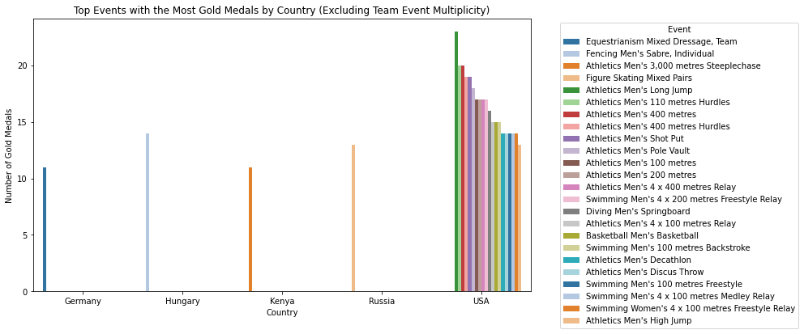
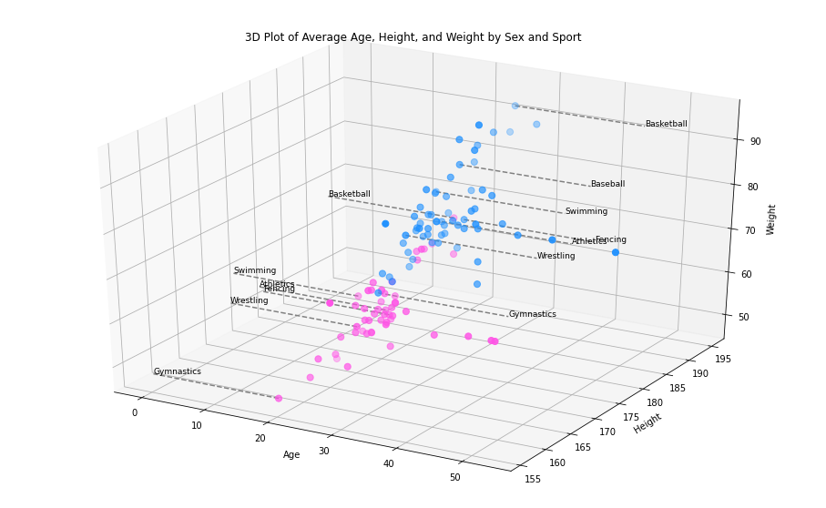
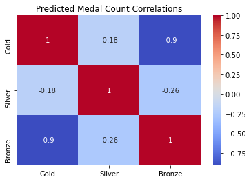

# 🏅 Olympic Dataset Analysis for SportsStats

**Sports Analytics · Exploratory Data Analysis · Data Preparation · Machine Learning**

> **UC Davis — Learn SQL Basics for Data Science Capstone**

Analyzed **271,116 Olympic athlete-event records** spanning approximately **120 years** to explore gender representation, athlete demographics, medal patterns, country and sport performance, and sport-specific physical profiles.

The project covers the full analytical workflow from **data cleaning and missing-value treatment to exploratory analysis, visualization, feature engineering, aggregation, and predictive modeling**. A later review of the original modeling work also identified target leakage in a Random Forest experiment—an important lesson in model validation and experimental design.

---

## ⭐ Key Highlights

- Analyzed **271K+ athlete-event records** across ~120 years of Olympic history.
- Created an **~180K athlete-year dataset** to prevent multi-event athletes from distorting athlete-level analyses.
- Designed variable-specific strategies for **9,474 missing Age, 60,171 Height, and 62,875 Weight values**.
- Analyzed historical trends across **gender, age, height, weight, medals, countries, and sports**.
- Female participation increased from near zero in the earliest Games to approximately **44% in the 2010s**.
- Used **Python, Pandas, NumPy, Matplotlib, Seaborn, and Scikit-learn**.
- Conducted regression and classification experiments and later identified **target leakage** in the original Random Forest model.

---

## 🎯 Problem & Objectives

The project was framed around **SportsStats**, a fictional sports analytics client seeking insights from historical Olympic data.

The analysis addressed questions such as:

- How has gender representation changed throughout Olympic history?
- At what ages are Olympic medals most frequently won?
- How have athlete age, height, and weight changed over time?
- Which sports show substantial historical differences in male and female participation?
- Which countries have historically performed strongly in particular sports?
- How do athlete physical profiles differ across disciplines?
- Can selected athlete and competition attributes support predictive modeling?

The project is primarily an **exploratory sports-analytics study**. Observed relationships are treated as historical associations rather than causal evidence.

---

## 🔄 Analytical Workflow

```text
Raw Olympic Data
        ↓
Data Inspection & Cleaning
        ↓
Missing-Value Treatment
        ↓
NOC / Region Integration
        ↓
Feature Engineering
        ↓
Athlete-Year Aggregation
        ↓
EDA & Visualization
        ↓
Predictive Modeling
        ↓
Critical Evaluation
```

---

## 📊 Dataset

The analysis uses:

- `athlete_events.csv`
- `noc_regions.csv`

| Attribute | Value |
|---|---:|
| Athlete-event records | **271,116** |
| Variables | **15** |
| Historical coverage | ~120 years |
| Athlete-year records | **~180,685** |
| Medal outcomes | Gold / Silver / Bronze / No Medal |

Key variables include:

`ID`, `Name`, `Sex`, `Age`, `Height`, `Weight`, `Team`, `NOC`, `Games`, `Year`, `Season`, `City`, `Sport`, `Event`, and `Medal`.

The NOC reference dataset provides regional information used for country- and region-level analysis.

---

## 🔧 Data Preparation & Methodology

### Missing-Value Treatment

The historical dataset contained substantial missing demographic information:

| Variable | Missing Values |
|---|---:|
| Age | **9,474** |
| Height | **60,171** |
| Weight | **62,875** |

Rather than dropping all incomplete records, I used **variable-specific strategies**.

For **Height and Weight**, missing values were reconstructed using increasingly broad reference groups:

1. information from the same athlete, where available;
2. event-and-sex averages;
3. sex-level averages as a fallback.

**Age required different treatment** because it changes over time. Where possible, missing age values were reconstructed from another known Olympic appearance by the same athlete and the difference between Olympic years.

This preserved substantially more historical information than complete-case deletion.

### Dataset Integration & Feature Engineering

Athlete records were merged with the NOC reference dataset to add regional information.

Additional features included:

- binary Gold, Silver, and Bronze indicators for medal analysis;
- BMI for exploratory physical-profile comparisons.

BMI was interpreted cautiously because it does not distinguish muscle mass from body fat and is therefore limited for elite athletes.

### Athlete-Year Aggregation

The original data operates at the **athlete-event level**. An athlete competing in several events during the same Games can therefore appear multiple times.

For athlete-level analyses, I created an additional representation grouped by:

```text
Athlete ID + Olympic Year
```

This produced approximately **180,685 athlete-year records** and reduced the risk of multi-event athletes disproportionately affecting demographic comparisons.

---

## 🔍 Key Findings

### Gender Representation

Female Olympic participation increased substantially over time:

| Period | Female Participation |
|---|---:|
| 1890s | ~0% |
| 1960s | ~14% |
| 1980s | ~24% |
| 2000s | ~40% |
| 2010s | ~44% |

Summer and Winter Games were also examined separately.

### Athlete Demographics

| Metric | Female | Male |
|---|---:|---:|
| Mean age | **24.41 years** | **26.28 years** |
| Mean height | **169.02 cm** | **179.45 cm** |
| Mean weight | **61.45 kg** | **76.90 kg** |

Medal-winning records were concentrated primarily among athletes in their **20s**, although age distributions varied substantially by sport.

### Sport-Specific Profiles

Age, height, and weight differed considerably across disciplines.

For example, taller profiles appeared in sports such as basketball and beach volleyball, while sports such as weightlifting showed very different height-to-weight characteristics.

> **There is no single “optimal Olympic athlete” profile.** Physical characteristics need to be interpreted within the requirements of individual sports and events.

### Country & Sport Performance

The project also explored:

- leading countries by medal count;
- Gold-medal distributions;
- country-specific sporting strengths;
- medal distributions across sports.

Country-level analysis required care because **one team medal can appear in multiple athlete records**, potentially inflating totals if every medal-bearing row is counted independently.

---

## 🤖 Predictive Modeling

### Linear Regression

A Linear Regression experiment explored medal-count prediction using selected athlete and competition features.

**Documented MSE:** `0.2222`

This was an exploratory modeling exercise rather than a production forecasting system.

### Random Forest & Target Leakage

The original Random Forest medal classifier produced:

**Test Accuracy: `100%`**

A later methodological review showed that `Gold`, `Silver`, and `Bronze` indicators were included among the predictors while the target was derived from `Medal`.

These variables directly encoded the outcome, creating **target leakage**.

The 100% accuracy therefore **does not represent valid predictive performance**.

A corrected experiment would use only information available before the medal outcome, remove all outcome-derived variables, and apply stronger validation procedures.

> **Key modeling lesson:** A high metric is not automatically a good result. Feature validity and experimental design must be checked before model performance can be trusted.

---

## 🧩 Challenges & How I Addressed Them

| Challenge | How I Addressed It | What It Taught Me |
|---|---|---|
| **Extensive missing demographic data** | Used variable-specific hierarchical imputation and temporal age reconstruction | Missing-data treatment should reflect what each variable represents |
| **Repeated athlete records** | Created an athlete-year representation for athlete-level analysis | The unit of observation must match the analytical question |
| **Team medal multiplicity** | Accounted for repeated team-medal records during country/sport aggregation | Understand what one row represents before counting |
| **100% model accuracy** | Audited feature construction and identified target leakage | Suspiciously strong results require investigation |
| **Association vs. explanation** | Separated observed patterns from causal interpretations | Historical association does not establish causation |

---

## 🛠️ Technical Stack

| Area | Technologies & Methods |
|---|---|
| **Programming** | Python |
| **Data Analysis** | Pandas, NumPy |
| **Data Preparation** | Cleaning, hierarchical imputation, aggregation, feature engineering |
| **Exploratory Analysis** | Descriptive statistics, longitudinal analysis, correlation analysis |
| **Visualization** | Matplotlib, Seaborn, 2D & 3D visualization |
| **Machine Learning** | Scikit-learn |
| **Models** | Linear Regression, Random Forest |
| **Environment** | Jupyter Notebook |

---

## 📊 Selected Visualizations

### Top Gold Medal Sports by Country



Examines the sports contributing the most Gold medals among leading Olympic countries while considering team-event multiplicity.

### Athlete Physical Profiles



Compares average age, height, and weight across sports and sex.

### Medal Count Correlations



Explores relationships among medal-count variables used during the predictive-analysis stage.

---

## ⚠️ Limitations & Future Improvements

### Limitations

- Historical Olympic participation was smaller and less globally representative in earlier periods.
- Height and weight contain substantial missingness; imputation introduces estimated values.
- Sports and events changed throughout Olympic history, affecting longitudinal comparisons.
- Team events require careful medal aggregation.
- BMI is a limited measure of body composition for elite athletes.
- Observational relationships do not establish causation.
- The original Random Forest experiment contains target leakage.

### If I Rebuilt It Today

I would prioritize:

- leakage-safe **pre-event features**;
- stronger baseline models and cross-validation;
- time-aware validation where appropriate;
- class-imbalance analysis;
- precision, recall, F1, ROC-AUC, and confusion-matrix evaluation;
- sport-specific predictive models;
- statistical significance testing;
- improved team-medal normalization;
- feature-importance or SHAP analysis;
- a clearer **SQL / relational analytical pipeline**;
- more recent Olympic data.

---

## 🧠 What I Learned

This project reinforced that much of data science happens **before model training**.

The most important lessons were:

- understand what each row represents before analyzing it;
- match the unit of observation to the analytical question;
- use missing-data strategies appropriate to each variable;
- validate aggregation logic before interpreting totals;
- distinguish association from causation;
- audit features for leakage before trusting model metrics;
- prefer sound experimental design over unnecessary model complexity.

The retrospective discovery of target leakage was particularly valuable:

> **Critical evaluation of a model is as important as building the model itself.**

---

## 💬 Interview Quick Reference

| Question | Quick Answer |
|---|---|
| **What was the project?** | Analysis of **271,116 Olympic athlete-event records** spanning ~120 years |
| **What was the goal?** | Explore participation, demographics, medal patterns, countries, sports, athlete profiles, and introductory predictive modeling |
| **What did you do?** | Cleaning, imputation, integration, aggregation, feature engineering, EDA, visualization, modeling, and evaluation |
| **Main tools?** | Python, Pandas, NumPy, Matplotlib, Seaborn, Scikit-learn |
| **Biggest data challenge?** | Extensive missing Age, Height, and Weight data |
| **How did you solve it?** | Variable-specific hierarchical imputation and temporal age reconstruction |
| **Structural challenge?** | Multi-event athletes created repeated records → built an **athlete-year dataset** |
| **Important analytical issue?** | Team events can duplicate a single national medal across several athlete records |
| **Major finding?** | Female participation reached approximately **44% in the 2010s** |
| **Modeling issue?** | The original 100% Random Forest result contained **target leakage** |
| **What did you learn from it?** | Validate feature availability and experimental design before trusting performance metrics |
| **What would you improve today?** | Leakage-safe modeling, stronger validation, sport-specific analysis, and a clearer SQL pipeline |

---

## 🎓 Project Context

This project was completed as a capstone within the **UC Davis Learn SQL Basics for Data Science** curriculum.

The assignment used a fictional consulting scenario in which I selected a dataset, formulated analytical questions and hypotheses, prepared and analyzed the data, and communicated the findings.

I retain the project in my portfolio because it demonstrates development across:

**Data Preparation · Exploratory Data Analysis · Feature Engineering · Visualization · Analytical Reasoning · Machine Learning · Critical Model Evaluation**

It also provides a useful reference point for how my approach to **data quality, experimental design, and model validation** has developed since the original project.

---

## 👤 Author

**Gregory Charles**

Data Science · Machine Learning · Generative AI · Applied Software Development

[← Back to Main Projects Portfolio](../README.md)
