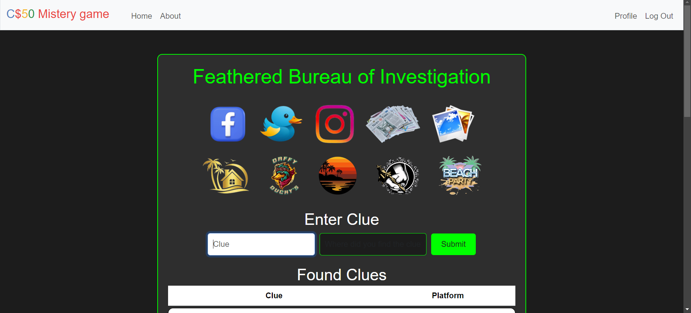
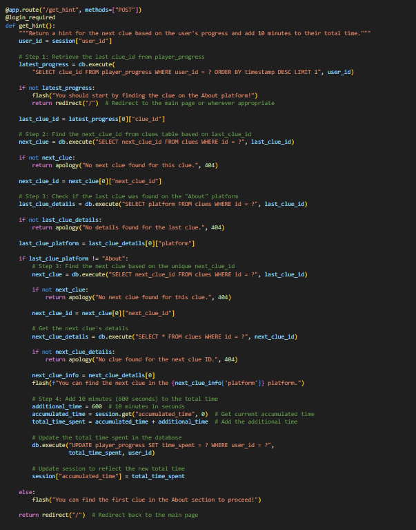
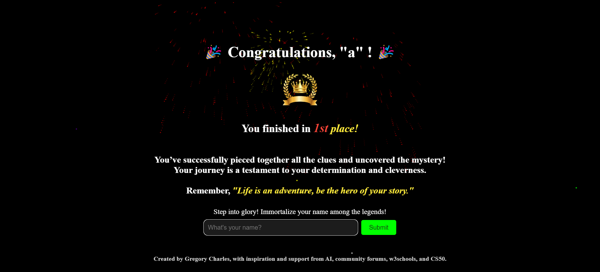

# Quacktastic Conundrum


**Quacktastic Conundrum** is a full-stack, browser-based mystery game developed as my **Harvard CS50 final project**. Inspired by the investigative structure of CS50's *Fiftyville* and the fragmented-memory premise of *The Hangover*, the game challenges players to reconstruct a chaotic weekend and recover Harvard's missing rubber duck mascot by following clues across interconnected fictional websites and locations.

Rather than presenting the mystery as a linear sequence of pages, the application uses **persistent player state, prerequisite-based clue progression, gated locations, simulated social-media accounts, contextual hints, gameplay timing, and a completion-time leaderboard** to create a state-driven investigation experience.

**Video Demo:** [Watch Quacktastic Conundrum](https://www.youtube.com/watch?v=M8YOX5bFVbg)

---


## Project Highlights

- Built a full-stack **Flask + SQLite** mystery game in which persistent application state drives the investigation.
- Designed a **22-clue dependency system** that unlocks routes, fictional accounts, and locations as players progress.
- Implemented registration, password hashing, server-side sessions, protected routes, and profile management.
- Created three custom social-media-inspired environments with secondary in-game authentication.
- Persisted gameplay time across sessions and connected hints to a **10-minute time penalty** and completion-time leaderboard.
- Combined Flask, Jinja2, SQL, JavaScript, Bootstrap, multimedia, and custom interfaces in one integrated application.
- Retrospectively reviewed the project for **security limitations, duplicated logic, testing gaps, and architectural technical debt**.

---

## Technical Highlights

- Full-stack **Flask** application with **SQLite** persistence
- User authentication, password hashing, and server-side session management
- Database-driven clue dependencies and progression
- Conditional route and content access based on player state
- Persistent gameplay timing across sessions
- Context-sensitive hint system with time penalties
- Simulated social platforms with secondary in-game authentication
- Custom JavaScript for multimedia, chat, lightboxes, and dynamic content
- Completion-time leaderboard and player ranking
- Server-side rendering with **Jinja2**

---

## Game Overview

Players wake up after a chaotic weekend with fragmented memories and one major problem: Harvard's rubber duck mascot is missing.

To reconstruct what happened, the player investigates a collection of fictional digital and physical environments, including:

- **Fakebook** — a social-network-style interface
- **Quacker** — a microblogging platform
- **Instaquam** — an image-focused social platform
- a smartphone-style **Gallery**
- a **Newspaper**
- a **Hotel**
- **Daffy Ducky's Pub**
- a **Beach**
- the **Dark Wing Tattoo** parlor
- the final **Beach Party**

Clues discovered in one environment can unlock access to another. Some in-game platforms require the player to reconstruct a friend's identity and credentials from previously discovered evidence.

The objective is therefore not simply to locate hidden text. Players must connect information across different interfaces, determine the correct sequence of events, and progressively reconstruct the story.

---

## Why I Built This

For my CS50 final project, I wanted to combine the programming concepts covered throughout the course with a larger creative challenge. Instead of building a conventional CRUD application, I designed a mystery game in which **application state forms part of the gameplay itself**.

The central technical challenge was making discoveries in one environment affect what the player could see or access elsewhere. This required coordinating authentication, database state, route protection, conditional rendering, client-side interaction, and persistent player progress across a multi-page Flask application.

The project also gave me an opportunity to design the complete user experience around the application logic rather than treating the front end and backend as separate exercises.

---

## Screenshots

| Dashboard | Fakebook |
| --- | --- |
|  |  |

| Hint System | Endgame |
| --- | --- |
|  |  |

---

## Core Features

### Authentication and Player Accounts

The application provides account registration, login, logout, and profile management.

- Passwords are hashed with **Werkzeug** before storage.
- Authentication state is maintained with **Flask-Session**.
- Protected routes use a `login_required` decorator.
- Players can update their username and password.
- Registration includes checks intended to limit repeated registrations from the same browser/device or IP address.
- Failed login attempts are tracked within the session.

### Persistent Clue Progression

Player discoveries are stored in SQLite.

Submitted clues are validated against the clue database. Individual clues can specify prerequisite clues, creating a dependency structure in which later parts of the investigation become available only after the player has found the necessary evidence.

The dashboard displays the player's discovered clues and overall progress through the game's **22 clues**.

### Gated Investigation Environments

Access to parts of the game world depends on player progress.

For example, the fictional social platforms require players to discover the relevant friend's identity and credentials before they can log in. Other locations, such as the tattoo parlor and final party, remain inaccessible until specific clues have been discovered.

Progression therefore depends on application state rather than simple page navigation.

### Fictional Social Platforms

The project contains three custom social-media-inspired environments:

- **Fakebook**
- **Quacker**
- **Instaquam**

These interfaces reproduce recognizable social-media interaction patterns while embedding evidence required to solve the mystery.

Each platform has an additional in-game authentication challenge. Players must first discover the appropriate friend's name, username, and password before access is granted.

### Contextual Hint System

Players can request guidance when they become stuck.

The application examines the player's current progress, determines the next relevant clue or platform, and returns an appropriate hint.

Using a hint adds a **10-minute penalty** to the player's accumulated time, creating a trade-off between assistance and leaderboard performance.

### Gameplay Timing

The application tracks gameplay duration across sessions.

Elapsed time is accumulated and persisted so that players can leave and return without losing their recorded play time. The resulting completion time is used by the ranking system.

### Scoreboard and Ranking

After completing the mystery, a player's completion time can be submitted to the scoreboard.

Players are ranked according to completion time, with faster completions receiving better positions. The scoreboard highlights the current player's entry, and completed accounts are prevented from recording multiple scores.

A separate legacy view allows returning players to see their ranking after completion.

### Interactive Front End

The project combines server-rendered Jinja templates with custom JavaScript interactions, including:

- image and video lightboxes
- dynamic clue visibility
- contextual character conversations
- progress visualization
- asynchronous gameplay-time updates
- multimedia content
- keyboard navigation
- visibility-aware video playback
- Canvas-based endgame effects

---

## Application Architecture

At a high level, the application follows this progression:

```text
Registration / Login
        |
        v
Story Introduction
        |
        v
Investigation Dashboard
        |
        v
Explore Platforms and Locations
        |
        v
Discover Evidence
        |
        v
Submit and Validate Clues
        |
        v
Persist Player Progress
        |
        v
Unlock New Content / Locations
        |
        v
Final Investigation and Puzzle
        |
        v
Completion Time + Ranking
```

### Backend

Flask handles:

- routing
- registration and authentication
- session management
- clue validation
- prerequisite checking
- location access control
- hint logic
- gameplay timing
- scoring and ranking
- server-side template rendering

### Database

SQLite stores application data including:

- users
- clue definitions
- player progress
- fictional friend/platform credentials
- gameplay time
- scoreboard results

The project uses both the **CS50 SQL library** and direct `sqlite3` connections.

### Front End

The user interface combines:

- HTML5
- CSS3
- Bootstrap
- Jinja2
- JavaScript

Individual investigation environments use dedicated styling to create visually distinct locations and fictional platforms while sharing the same underlying Flask application state.

---

## Technology Stack

| Technology | Role |
| --- | --- |
| **Python** | Backend application and game logic |
| **Flask** | Web framework and routing |
| **Jinja2** | Server-side HTML templating |
| **SQLite** | Persistent game and player data |
| **CS50 SQL Library** | Simplified SQL database operations |
| **HTML5** | Page structure and multimedia |
| **CSS3** | Custom interfaces and responsive presentation |
| **JavaScript** | Client-side game interactions |
| **Bootstrap** | Shared responsive UI components |
| **Flask-Session** | Server-side session management |
| **Werkzeug** | Password hashing and verification |
| **Bleach** | Input sanitization |
| **python-dotenv** | Environment-variable loading |
| **Git LFS** | Management of large media assets |

---

## Game Flow

A typical investigation follows this pattern:

1. **Register and log in.**
2. **Read the story introduction** to understand the mystery.
3. **Explore the initial environments** and identify the first clues.
4. **Submit discovered clues** through the dashboard.
5. **Unlock additional platforms and locations** as prerequisites are satisfied.
6. **Reconstruct in-game credentials** to access fictional social-media accounts.
7. **Connect evidence** across posts, photographs, conversations, locations, and articles.
8. **Use hints when necessary**, accepting the associated time penalty.
9. **Complete the final investigation and hidden-message puzzle.**
10. **Submit the final result** and receive a completion-time ranking.

---

## Selected Routes

| Route | Purpose |
| --- | --- |
| `/` | Investigation dashboard |
| `/register` | Player registration |
| `/login` | Player authentication |
| `/logout` | Save elapsed time and end the session |
| `/profile` | Update player credentials |
| `/about` | Story introduction |
| `/clue_input` | Validate and record submitted clues |
| `/get_hint` | Retrieve a progress-dependent hint |
| `/update_time` | Persist gameplay time from the client |
| `/fakebook` | Fakebook investigation |
| `/quacker` | Quacker investigation |
| `/instaquam` | Instaquam investigation |
| `/gallery` | Smartphone-style gallery |
| `/newspaper` | Newspaper investigation |
| `/hotel` | Hotel investigation |
| `/bar` | Pub investigation |
| `/beach` | Beach investigation |
| `/tattoo` | Tattoo-parlor investigation |
| `/party` | Final party sequence |
| `/endgame` | Completion and score submission |
| `/scoreboard` | Completion-time leaderboard |
| `/legacy` | Returning-player ranking page |

---

## Project Structure

```text
project/
├── static/
│   ├── css/                 # Interface-specific stylesheets
│   ├── images/              # Game artwork, media, icons, and screenshots
│   └── script.js            # Shared client-side interactions
│
├── templates/
│   ├── about.html
│   ├── apology.html
│   ├── bar.html
│   ├── beach.html
│   ├── endgame.html
│   ├── fakebook.html
│   ├── fakebook_login.html
│   ├── gallery.html
│   ├── hotel.html
│   ├── index.html
│   ├── instaquam.html
│   ├── instaquam_login.html
│   ├── layout.html
│   ├── legacy.html
│   ├── login.html
│   ├── newspaper.html
│   ├── party.html
│   ├── profile.html
│   ├── quacker.html
│   ├── quacker_login.html
│   ├── register.html
│   ├── scoreboard.html
│   └── tattoo.html
│
├── app.py                   # Flask application and game logic
├── helpers.py               # Shared helpers and authentication decorator
├── game.db                  # SQLite game database
├── requirements.txt         # Python dependencies
├── .gitattributes           # Git LFS configuration
├── LICENSE
└── README.md
```

---

## Installation and Setup

### Prerequisites

- Python 3.x
- SQLite
- Git

### 1. Clone the repository

```bash
git clone <repository-url>
cd <repository-directory>
```

### 2. Create a virtual environment

```bash
python -m venv .venv
```

Activate the environment.

**macOS / Linux**

```bash
source .venv/bin/activate
```

**Windows**

```bash
.venv\Scripts\activate
```

### 3. Install dependencies

```bash
pip install -r requirements.txt
```

> **Repository note:** If using the original CS50 submission version of `requirements.txt`, ensure it contains package names only. Entries written as `pip install python-dotenv` or `pip install bleach` should be changed to `python-dotenv` and `bleach`.

### 4. Configure environment variables

Create a `.env` file in the project root:

```text
SECRET_KEY=<your-secret-key>
API_KEY=<your-api-key-if-required>
```

Do not commit `.env` or production secrets to source control.

### 5. Prepare the database

The application expects a populated `game.db` SQLite database containing the game data and player-related tables.

### 6. Run the application

```bash
flask --app app run
```

Open the local address displayed by Flask in a browser.

> **Development note:** The current application configuration marks the session cookie as `Secure`. Browser behavior during plain-HTTP local development may therefore depend on the environment. HTTPS should be used for a production deployment.

---

## Security Considerations

The project implements several security-oriented measures appropriate to its educational scope:

- password hashing rather than plaintext password storage
- server-side sessions
- `HttpOnly`, `Secure`, and `SameSite=Lax` session-cookie settings
- authenticated-route protection
- input sanitization
- username uniqueness checks
- basic failed-login attempt handling

The registration system also experiments with browser fingerprinting and IP-based duplicate-registration checks. These mechanisms were designed to control game-account creation rather than serve as production-grade identity or anti-abuse systems.

### Security Limitation

The current Bleach allowlist includes powerful HTML elements and event-related attributes. The sanitization configuration should therefore **not be considered production-grade XSS protection for arbitrary untrusted public input** without additional hardening.

---


## Challenges & How I Addressed Them

| Challenge | How I Addressed It | What It Taught Me |
| --- | --- | --- |
| **Managing progression across interconnected environments** | Stored clue discoveries and prerequisites in SQLite and checked player state before unlocking routes, accounts, and content | Application state can be part of the product experience, not just backend bookkeeping |
| **Keeping player progress across sessions** | Persisted discoveries and accumulated gameplay time rather than relying only on temporary browser state | Stateful applications require deliberate persistence and session design |
| **Connecting clues across different interfaces** | Used shared backend state so evidence discovered in one environment could affect another | Backend logic, database design, and UI behavior need to be designed as one system |
| **Providing help without removing the challenge** | Built contextual hints based on player progress and attached a 10-minute scoring penalty | Product rules can balance usability and game mechanics |
| **Growing complexity as the application expanded** | Completed the working application, then identified duplicated platform logic, mixed database access, and opportunities for modularization | Delivering a system and critically evaluating its technical debt are both part of software engineering |
| **Applying security concepts within an educational project** | Used password hashing, server-side sessions, route protection, and sanitization while documenting where production hardening is still required | Security controls need to be evaluated according to their actual threat model and deployment context |

---

## Design Decisions and Technical Debt

This project was developed as a CS50 final project and prioritizes delivering a complete interactive experience. Reviewing the completed application also identified several areas that could be improved in a production-oriented revision.

### Database Access

The application currently uses both the CS50 `SQL` abstraction and direct `sqlite3` connections.

A future version would standardize database operations behind a single data-access approach, improving consistency, maintainability, and testability.

### Reusable Platform Components

Fakebook, Quacker, and Instaquam have similar authentication flows and separate login templates.

These could be refactored into reusable backend logic and a shared parameterized template while preserving platform-specific styling.

### Application Structure

As the application grew, much of the backend logic remained in `app.py`.

A larger production version could separate responsibilities into Flask blueprints or modules for:

- authentication
- player progress
- investigation environments
- scoring
- database access

### Security Hardening

A production deployment would benefit from:

- CSRF protection for state-changing forms
- stronger server-side login rate limiting
- a stricter HTML sanitization policy
- hardened secret management
- explicit database constraints and migrations
- review of browser-fingerprinting and IP-retention practices

### Automated Testing

A future version could add automated tests for:

- registration and authentication
- clue prerequisites
- clue submission
- gated-route access
- hint penalties
- gameplay-time persistence
- ranking logic
- duplicate score prevention

---

## Future Development

Potential extensions include:

- modularizing the Flask application
- improving mobile responsiveness and accessibility
- adding automated unit and integration tests
- expanding puzzle mechanics
- adding additional investigation scenarios using the same progression model
- deployment-oriented security hardening
- introducing cooperative or multiplayer investigation
- experimenting with more dynamic hint generation

---

## What I Learned

Quacktastic Conundrum brought together concepts from across CS50 into one larger application. Building it required moving beyond isolated programming exercises and considering how **authentication, persistent data, application state, front-end interaction, and user experience** work together.

The most important engineering challenge was managing **progression across interconnected environments**. A clue discovered in one location could determine whether another route, account, or piece of content should become available. Implementing this required coordinating database state, Flask routing, Jinja rendering, sessions, and JavaScript behavior.

The project also demonstrated how quickly complexity grows in a stateful application. Completing it highlighted the importance of reducing duplicated code, separating responsibilities, designing database interactions consistently, testing state-dependent behavior, and distinguishing educational security measures from production security architecture.

Most importantly, the project taught me to think about software not simply as a collection of individual features, but as an interconnected system in which backend logic, persistent state, interface design, and user behavior influence one another.

---


## Interview Quick Reference

| Question | Quick Answer |
| --- | --- |
| **What was the project?** | A full-stack browser-based mystery game built as my Harvard CS50 final project |
| **What was the core technical idea?** | Persistent player state drives clue dependencies, route access, fictional-account access, hints, timing, and progression |
| **Main stack?** | Python, Flask, SQLite, Jinja2, JavaScript, HTML/CSS, Bootstrap |
| **What was the biggest challenge?** | Coordinating progression across many interconnected pages and environments without losing player state |
| **How did you solve it?** | Stored discoveries and prerequisites in the database and used server-side state checks to control access and rendering |
| **Interesting feature?** | Context-sensitive hints add a 10-minute penalty, connecting assistance directly to leaderboard performance |
| **Security work?** | Password hashing, server-side sessions, protected routes, sanitization, and cookie settings, with production limitations documented |
| **Main technical debt?** | Large `app.py`, duplicated platform authentication flows, mixed SQL access approaches, and limited automated testing |
| **What would you improve today?** | Modular Flask blueprints, unified data access, automated tests, CSRF/rate limiting, stricter sanitization, and stronger secret management |
| **Main lesson?** | Stateful software must be designed as an interconnected system across backend logic, persistence, interface behavior, and user experience |

---

## Acknowledgments

This project was created as my **Harvard CS50 final project**.

It draws inspiration from:

- **CS50** and the investigative structure of *Fiftyville*
- *The Hangover* as inspiration for the fragmented-memory mystery premise
- Flask and its open-source ecosystem
- programming documentation and community resources used during development
- AI tools used as development aids for brainstorming, debugging, code assistance, and documentation

The application's story, game structure, clue progression, interfaces, and overall implementation were developed as part of the project.

---

## License

This project is licensed under the MIT License. See [`LICENSE`](LICENSE) for details.
