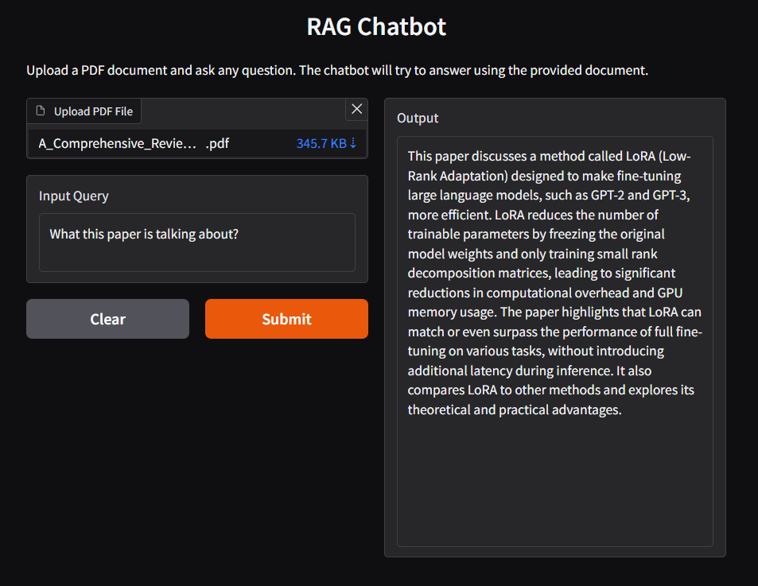

# 🤖 RAG-Powered Q&A Bot with LangChain and watsonx.ai

This project implements a complete **Retrieval-Augmented Generation (RAG)** pipeline using **LangChain** and **IBM watsonx.ai** to enable question-answering over custom, uploaded PDF documents.

The application allows users to upload a PDF file and ask specific questions, with the LLM leveraging the content of the document for accurate, context-aware answers.

**Final Application Interface:**


***

## ⚙️ Key Technologies

* **Orchestration:** [LangChain](https://www.langchain.com/) (The framework connecting all components)
* **LLM (Generator):** **Mistral Medium** on IBM watsonx.ai
* **Embedding Model:** **Slate-30m-English-RTRVR-v2** on IBM watsonx.ai
* **Vector Store:** [ChromaDB](https://www.trychroma.com/) (Local persistence for vector embeddings)
* **Document Loading:** `PyPDFLoader`
* **Web Interface:** [Gradio](https://www.gradio.app/) (For a simple, interactive chat UI)

***

## 🚀 How It Works (The RAG Pipeline)

The bot operates through a six-step RAG pipeline to generate answers:

1.  **Ingestion (`document_loader`):** A user uploads a PDF. The `PyPDFLoader` extracts the raw text content.
2.  **Chunking (`text_splitter`):** A `RecursiveCharacterTextSplitter` breaks the document into smaller, manageable chunks (1000 characters with 200 character overlap).
3.  **Vectorization (`watsonx_embedding`):** The chunks are converted into numerical vectors (embeddings) using the `Slate-30m` model.
4.  **Storage (`vector_database`):** These vectors are stored in the local Chroma vector database.
5.  **Retrieval (`retriever`):** When a user asks a question, the question is also converted to a vector. The retriever searches the ChromaDB for the most relevant document chunks (the "context").
6.  **Generation (`retriever_qa`):** The Mistral LLM receives both the **user's question** and the **retrieved context** and synthesizes a final, grounded answer.

***

## 🛠️ Environment Setup and Installation

### 1. Prerequisites

You must have an **IBM watsonx.ai account** and obtain the necessary credentials (API Key and Project ID) to configure the connection strings in your Python file.

### 2. Environment Setup

It is highly recommended to use a virtual environment to manage dependencies:

```bash
# 1. Install virtualenv (if you don't have it)
pip install virtualenv

# 2. Create a virtual environment named 'my_env'
virtualenv my_env

# 3. Activate the environment
source my_env/bin/activate
```

### 3. Install Dependencies

Install the exact version-locked packages used for this project:

```Bash
# Using python3.11 or your preferred interpreter:
python3.11 -m pip install \
gradio==4.44.0 \
ibm-watsonx-ai==1.1.2 \
langchain==0.2.11 \
langchain-community==0.2.10 \
langchain-ibm==0.1.11 \
chromadb==0.4.24 \
pypdf==4.3.1 \
pydantic==2.9.1
```

### 4. Run the Application

Save the main code as `qabot.py`. Run the file to launch the Gradio interface:

Run the file to launch the Gradio interface:
```Bash
python qabot.py
```
The application will launch and be accessible in your browser (e.g., at `http://0.0.0.0:7863`).
